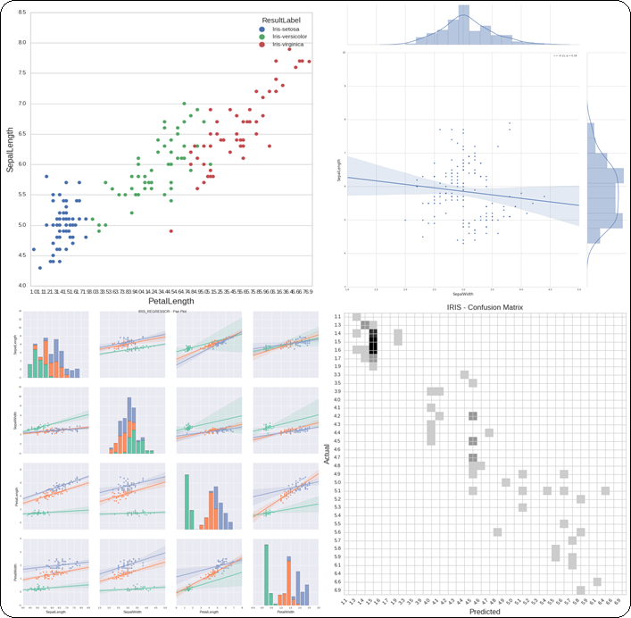

=======================================================================
Sci-Pype - A Machine Learning Framework for Sharing Models and Analysis
=======================================================================

Sci-Pype is a framework for analyzing datasets using Python 2.7 and extended from the `Jupyter Scipy-Notebook`_ and a supported command line version. It was built to make data analysis easier by providing an API to build, train, test, predict, validate, analyze, extract, archive, and import Models and Analysis datasets with: S3 and redis (Kafka coming soon). After building and training the requested Models with a dataset, they are cached in redis along with their respective Analysis. After they are cached, they can be extracted and shared using S3. From S3, the Models can be imported back into redis for making new predictions using the same API. 

    
    Analyzing the IRIS dataset with Sci-Pype

Common use cases for this framework are sharing Analysis notebooks and then automating new predictions with email delivery using AWS SES. With this native caching + deployment layer, you can build, train and use the supported Machine Learning Algorithms and Models across multiple environments (including multi-tenant ones). Once trained, you can extract the Models as a compressed, serialized ``Model file`` (like a build artifact) that is uploaded to S3. Importing a ``Model file`` decompresses the file and stores the Pickle-serialized Models + Analysis objects in redis. In production, it might be useful to house larger Models in something like a `load-balanced redis cluster`_ for sharing and making new predictions across a team or by automation.

Please note this is a `large docker container`_ so it may take some time to download and it extracts to ~8.1 GB on disk.

.. _Jupyter Scipy-Notebook: https://github.com/jupyter/docker-stacks/tree/master/scipy-notebook
.. _load-balanced redis cluster: https://github.com/jay-johnson/docker-redis-haproxy-cluster
.. _large docker container: https://hub.docker.com/r/jayjohnson/jupyter/tags/

Notebook Examples
=================

Please refer to the `examples directory`_ for the latest notebooks. Most of the notebooks and command line tools require running with a redis server listening on port 6000 (``<repo base dir>/dev-start.sh`` will start one). 

.. _examples directory: https://github.com/jay-johnson/sci-pype/tree/master/examples

#.  `ML-IRIS-Analysis-Workflow-Classification.ipynb`_

    Build a unique Machine Learning Classifier (parameterized XGB by default) for each column in the IRIS dataset. After training and testing the Models, perform a general analysis on each column and save + display images generated during each step. After running, the Models + Analysis are Pickled into a set of objects stored in a set of unique redis cache keys. These leaf nodes are organized into a set of redis keys contained in the ``manifest`` node for retrieval as needed in the future (like a tree of Machine Learning Algorithm Models with their associated pre-computed Analysis in memory).

#.  `ML-IRIS-Analysis-Workflow-Regression.ipynb`_
    
    Build a unique Machine Learning Regressor (parameterized XGB by default) for each column in the IRIS dataset. After training and testing the Models, perform a general analysis on each column and save + display images generated during each step. After running, the Models + Analysis are Pickled into a set of objects stored in a set of unique redis cache keys. These leaf nodes are organized into a set of redis keys contained in the ``manifest`` node for retrieval as needed in the future (like a tree of Machine Learning Algorithm Models with their associated pre-computed Analysis in memory).

#.  `ML-IRIS-Extract-Models-From-Cache.ipynb`_

    Extract all Models and Analysis records from redis and compile a large Pickle-serialized dictionary. Create a ``manifest`` for decoupling Model + Analysis nodes and compress the dictionary object (using zlib) and write it to disk as a ``Model file`` (``*.cache.pickle.zlib``). After creating the file on disk, upload it to the configured S3 Bucket and Key.
    
    Once uploaded to the S3 Bucket you should be able to view, download and share the ``Model files``:

    .. figure:: ./examples/images/scipype_s3_bucket_with_xgb_classifier_and_regressor_models_as_pickled_object_files.png

        S3 Bucket containing the IRIS ``Model Files``

#.  `ML-IRIS-Import-and-Cache-Models-From-S3.ipynb`_

    Download the S3 IRIS ``Model file`` from the configured S3 Bucket + Key and decompress the previously-built Analysis and Models using Pickle to store them all in the redis cache according to the ``manifest``. This includes examples from the IRIS sample dataset and requires you to have a valid S3 Bucket storing the Models and are comfortable paying for the download costs to retrieve the ``Model file`` from S3 (https://aws.amazon.com/s3/pricing/).

#.  `ML-IRIS-Predict-From-Cache-for-New-Predictions-and-Analysis-Classifier.ipynb`_

    This notebook shows how to make new predictions with cached IRIS Classifier Models + Analysis housed in redis. 
    
#.  `ML-IRIS-Predict-From-Cache-for-New-Predictions-and-Analysis-Regressor.ipynb`_

    This notebook shows how to make new predictions with cached IRIS Regressor Models + Analysis housed in redis. 
    

Command Line Examples
=====================

Most of the notebooks and command line tools require running with a redis server listening on port 6000 (``<repo base dir>/dev-start.sh`` will start one). The command line versions that do not require docker or Jupyter can be found:

::
    
    <repo base dir>
    ├── bins
    │   ├── demo-running-locally.py - Simple validate env is working test
    │   ├── ml
    │   │   ├── builders - Build and Train Models then Analyze Predictions without display any plotted images (automation examples)
    │   │   │   ├── build-classifier-iris.py
    │   │   │   └── build-regressor-iris.py
    │   │   ├── demo-ml-classifier-iris.py - Command line version of: ML-IRIS-Analysis-Workflow-Classification.ipynb
    │   │   ├── demo-ml-regressor-iris.py - Command line version of: ML-IRIS-Analysis-Workflow-Regression.ipynb
    │   │   ├── downloaders
    │   │   │   └── download_iris.py - Command line tool for downloading + preparing the IRIS dataset
    │   │   ├── extractors
    │   │   │   ├── extract_and_upload_iris_classifier.py - Command line version of: ML-IRIS-Extract-Models-From-Cache.ipynb (Classifier)
    │   │   │   └── extract_and_upload_iris_regressor.py - Command line version of: ML-IRIS-Extract-Models-From-Cache.ipynb (Regressor)
    │   │   ├── importers
    │   │   │   ├── import_iris_classifier.py - ML-IRIS-Import-and-Cache-Models-From-S3.ipynb (Classifier)
    │   │   │   └── import_iris_regressor.py - ML-IRIS-Import-and-Cache-Models-From-S3.ipynb (Regressor)
    │   │   └── predictors
    │   │       ├── predict-from-cache-iris-classifier.py - ML-IRIS-Predict-From-Cache-for-New-Predictions-and-Analysis-Classifier.ipynb (Classifier)
    │   │       └── predict-from-cache-iris-regressor.py - ML-IRIS-Predict-From-Cache-for-New-Predictions-and-Analysis-Regressor.ipynb (Regressor)

Now you can share, test, and deploy Models and their respective Analysis from a file in S3 for other Sci-Pype users running on different environments.

.. _ML-IRIS-Analysis-Workflow-Classification.ipynb: ./examples/ML-IRIS-Analysis-Workflow-Classification.ipynb
.. _ML-IRIS-Analysis-Workflow-Regression.ipynb: ./examples/ML-IRIS-Analysis-Workflow-Regression.ipynb
.. _ML-IRIS-Extract-Models-From-Cache.ipynb: ./examples/ML-IRIS-Extract-Models-From-Cache.ipynb
.. _ML-IRIS-Import-and-Cache-Models-From-S3.ipynb: ./examples/ML-IRIS-Import-and-Cache-Models-From-S3.ipynb
.. _ML-IRIS-Predict-From-Cache-for-New-Predictions-and-Analysis-Classifier.ipynb: ./examples/ML-IRIS-Predict-From-Cache-for-New-Predictions-and-Analysis-Classifier.ipynb
.. _ML-IRIS-Predict-From-Cache-for-New-Predictions-and-Analysis-Regressor.ipynb: ./examples/ML-IRIS-Predict-From-Cache-for-New-Predictions-and-Analysis-Regressor.ipynb

Overview
========

The docker container runs a Jupyter web application. The web application runs `Jupyter Notebooks`_ as kernels. For now the examples and core included in this repository will only work with Python 2.

.. _Jupyter Notebooks: http://jupyter-notebook.readthedocs.io/en/latest/

This container can run in four modes:

#.  Default development

    This mode will mount your changes from the repository into the container at runtime for local testing.

    To start the local development version run: dev-start.sh_

    ::

        ./dev-start.sh

    You can login to the container with: ``./ssh.sh``
    
    .. _dev-start.sh: https://github.com/jay-johnson/sci-pype/blob/s3_and_machine_learning_api/dev-start.sh

#.  Docker Run Single Container

    To start the local development version run: start.sh_

    ::

        ./start.sh

    You can login to the container with: ``./ssh.sh``
    
    .. _start.sh: https://github.com/jay-johnson/sci-pype/blob/master/start.sh

#.  Full Stack

    To start the full stack mode run: compose-start-full.sh_
    
    ::

        ./compose-start-full.sh

    The full-stack-compose.yml_ will deploy three docker containers using docker compose:
    
    - **MySQL Database container with phpMyAdmin** for Stock Data (from the `schemaprototyping repo`_) 
    - **Jupyter**
    - **Redis server** (`jayjohnson/redis-single-node`_) on port 6000
    
    .. _compose-start-full.sh: https://github.com/jay-johnson/sci-pype/blob/master/compose-start-full.sh
    .. _full-stack-compose.yml: https://github.com/jay-johnson/sci-pype/blob/master/full-stack-compose.yml
    .. _schemaprototyping repo: https://github.com/jay-johnson/docker-schema-prototyping-with-mysql
    .. _jayjohnson/redis-single-node: https://hub.docker.com/r/jayjohnson/redis-single-node

#.  Standalone Testing
    
    To start the full stack mode run: compose-start-jupyter.sh_

    ::

        ./compose-start-jupyter.sh

    The jupyter-docker-compose.yml_ is used to deploy a single Jupyter container.

    .. _compose-start-jupyter.sh: https://github.com/jay-johnson/sci-pype/blob/master/compose-start-jupyter.sh
    .. _jupyter-docker-compose.yml: https://github.com/jay-johnson/sci-pype/blob/master/jupyter-docker-compose.yml

Running Locally without Docker
==============================

Here is how to run locally without using docker (and Lambda deployments in the future).

#.  Clone the repo without the dash character in the name

    ::

        $ git clone git@github.com:jay-johnson/sci-pype.git scipype

#.  Go to the base dir of the repository

    ::

        dev$ cd scipype

#.  Set up a local virtual environment using the installer

    This will take some time and may fail due to missing packages on your host. Please refer to the `Coming Soon and Known Issues`_ section for help getting passed these issues.

    ::
    
        scipype$ ./setup-new-dev.sh

    After this finishes you should see the lines:

    ::

        ---------------------------------------------------------
        Activate the new Scipype virtualenv with:
        
        source ./dev-properties.sh"
           or:
        source ./properties.sh

#.  Activate the ``scipype`` virtual environment for development:

    ::

        $ source ./dev-properties.sh

#.  Confirm your virtual environment is ready for use

    ::

        (scipype) scipype$ pip list --format=columns | grep -E -i "tensorflow|pandas|redis|kafka|xgboost|scipy|scikit"
        confluent-kafka                    0.9.2                                                 
        kafka-python                       1.3.1                                                 
        pandas                             0.19.2                                                
        pandas-datareader                  0.2.2                                                 
        pandas-ml                          0.4.0                                                 
        redis                              2.10.5                                                
        scikit-image                       0.12.3                                                
        scikit-learn                       0.18.1                                                
        scikit-neuralnetwork               0.7                                                   
        scipy                              0.18.1                                                
        tensorflow                         0.12.0                                                
        xgboost                            0.6a2                                                 
        (scipype) scipype$ 

#.  If you want to always use this virtual environment add this to your ``~/.bashrc``

    ::

        echo 'source /opt/venv/scipype/bin/activate' >> ~/.bashrc

#.  Confirm the Demo downloader works using the Virtual Environment

    Please note: this assumes running from a new terminal to validate the virtual environment activation

    Activate it

    ::

        scipype$ source ./dev-properties.sh

    Run the Demo

    ::

        (scipype) scipype$ ./bins/demo-running-locally.py 
        Downloading(SPY) Dates[Jan, 02 2016 - Jan, 02 2017]
        Storing CSV File(/opt/scipype/data/src/spy.csv)
        Done Downloading CSV for Ticker(SPY)
        Success File exists: /opt/scipype/data/src/spy.csv

    Deactivate it

    ::

        (scipype) scipype$ deactivate 
        scipype$ 

#.  If you want to automatically load the full Scipype environment ``properties.sh`` for any new shell terminal add this to your user's ``~/.bashrc``

    ::

        echo 'source /opt/work/properties.sh' >> ~/.bashrc

.. _Coming Soon and Known Issues: https://github.com/jay-johnson/sci-pype/blob/master/README.rst#coming-soon-and-known-issues

Previous Examples
=================

Version 1 Examples:
-------------------

#.  `example-core-demo.ipynb`_ 

    How to use the python core from a Jupyter notebook. It also shows how to debug the JSON application configs which are used to connect to external database(s) and redis server(s).
    
    .. figure:: https://jaypjohnson.com/_images/image_2016-08-01_core-integration.png

#.  `example-spy-downloader.ipynb`_

    **Jupyter + Downloading the SPY Pricing Data**

    Download the SPY ETF Pricing Data from Google Finance and store it in the shared ``ENV_PYTHON_SRC_DIR`` directory that is mounted from the host and into the Jupyter container. It uses a script that `downloads the SPY daily pricing data as a csv file`_.

    .. figure:: https://jaypjohnson.com/_images/image_2016-08-01_download-spy-pricing-data.png

#.  `example-plot-stock-data.ipynb`_

    **Download SPY and use Pandas + Matlab to Plot Pricing by the Close**

    This shows how to download the SPY daily prices from Google Finance as a csv then load it using Pandas for plotting on the Close prices with Matlab.

    .. figure:: https://jaypjohnson.com/_images/image_2016-08-01_plot-spy-by-close-prices.png

#.  `example-redis-cache-demo.ipynb`_

    **Building a Jupyter + Redis Data Pipeline**

    This extends the previous SPY pricing demo and publishes + retreives the pricing data by using a targeted ``CACHE`` redis server (that runs inside the Jupyter container). It stores the Pandas dataframe as JSON in the ``LATEST_SPY_DAILY_STICKS`` redis key.

    .. figure:: https://jaypjohnson.com/_images/image_2016-08-01_redis-data-pipeline-with-spy-prices.png

#.  `example-db-extract-and-cache.ipynb`_

    **Building a Jupyter + MySQL + Redis Data Pipeline**

    This requires running the **Full Stack** which uses the https://github.com/jay-johnson/sci-pype/blob/master/full-stack-compose.yml to deploy three docker containers on the same host:
    
    - MySQL (https://hub.docker.com/r/jayjohnson/schemaprototyping/)
    - Jupyter (https://hub.docker.com/r/jayjohnson/jupyter/)
    - Redis (https://hub.docker.com/r/jayjohnson/redis-single-node/)

    **How it works**

    .. figure:: https://jaypjohnson.com/_images/image_2016-08-01_using-jupyter-for-stock-analysis.png

    1. Extract the IBM stock data from the MySQL dataset and store it as a csv inside the **/opt/work/data/src/ibm.csv** file
    2. Load the IBM pricing data with Pandas
    3. Plot the pricing data with Matlab
    4. Publish the Pandas Dataframe as JSON to Redis
    5. Retrieve the Pandas Dataframe from Redis
    6. Test the cached pricing data exists outside the Jupyter container with:

        ::

            $ ./redis.sh 
            SSH-ing into Docker image(redis-server)
            [root@redis-server container]# redis-cli -h localhost -p 6000
            localhost:6000> LRANGE LATEST_IBM_DAILY_STICKS 0 0
            1) "(dp0\nS'Data'\np1\nS'{\"Date\":{\"49\":971136000000,\"48\":971049600000,\"47\":970790400000,\"46\":970704000000,\"45\":970617600000,\"44\":970531200000,\"43\":970444800000,\"42\":970185600000,\"41\":970099200000,\"40\":970012800000,\"39\":969926400000,\"38\":969

             ... removed for docs ... 

            localhost:6000> exit
            [root@redis-server container]# exit
            exit
            $

#.  `example-slack-debugging.ipynb`_

    **Jupyter + Slack Driven Development**

    This example shows how environment variables allow the python core to publish a message into Slack to notify the associated user with a message containing the line number and source code that threw the exception.

    .. figure:: https://jaypjohnson.com/_images/image_2016-08-01_slack-debugging.png

    .. _example-core-demo.ipynb: https://github.com/jay-johnson/sci-pype/blob/master/examples/example-core-demo.ipynb
    .. _example-slack-debugging.ipynb: https://github.com/jay-johnson/sci-pype/blob/master/examples/example-slack-debugging.ipynb
    .. _example-spy-downloader.ipynb: https://github.com/jay-johnson/sci-pype/blob/master/examples/example-spy-downloader.ipynb
    .. _example-plot-stock-data.ipynb: https://github.com/jay-johnson/sci-pype/blob/master/examples/example-plot-stock-data.ipynb
    .. _example-redis-cache-demo.ipynb: https://github.com/jay-johnson/sci-pype/blob/master/examples/example-redis-cache-demo.ipynb
    .. _example-db-extract-and-cache.ipynb: https://github.com/jay-johnson/sci-pype/blob/master/examples/example-db-extract-and-cache.ipynb
    .. _downloads the SPY daily pricing data as a csv file: https://github.com/jay-johnson/sci-pype/blob/master/bins/download-spy-csv.py

Components
==========

#.  Python 2 Core

    The PyCore_ uses a `JSON config file`_ for connecting to `redis servers`_ and `configurable databases`_ (MySQL and Postgres) using SQLAlchemy. It has only been tested with the Python 2.7 kernel.

    .. _PyCore: https://github.com/jay-johnson/sci-pype/blob/master/src/pycore.py
    .. _JSON config file: https://github.com/jay-johnson/sci-pype/blob/master/configs/jupyter.json
    .. _redis servers: https://github.com/jay-johnson/sci-pype/blob/master/configs/redis.json
    .. _configurable databases: https://github.com/jay-johnson/sci-pype/blob/master/configs/db.json

#.  Local Redis Server

    When starting the container with ``ENV_DEPLOYMENT_TYPE`` set to anything not ``JustDB``, the container will start a local redis server inside the container on port ``6000`` for iterating on your pipeline analysis, Model deployment and caching strategies.

#.  Loading Database and Redis Applications

    By default the `jupyter.json`_ config supports multiple environments for integrating notebooks with external resources. Here is table on what they define:

    +-----------+---------------------------------------------------+-----------------------+-----------------------+
    | Name      | Purpose                                           | Redis Applications    | Database Applications | 
    +===========+===================================================+=======================+=======================+
    | Local     | Use the internal redis server with the stock db   | `local-redis.json`_   | `db.json`_            |
    +-----------+---------------------------------------------------+-----------------------+-----------------------+
    | NoApps    | Run the core without redis servers or databases   | `empty-redis.json`_   | `empty-db.json`_      |
    +-----------+---------------------------------------------------+-----------------------+-----------------------+
    | JustRedis | Run with just the redis servers and no databases  | `local-redis.json`_   | `empty-db.json`_      |
    +-----------+---------------------------------------------------+-----------------------+-----------------------+
    | JustDB    | Run without redis servers and load the databases  | `empty-redis.json`_   | `db.json`_            |
    +-----------+---------------------------------------------------+-----------------------+-----------------------+
    | Test      | Connect to external redis servers and databases   | `redis.json`_         | `db.json`_            |
    +-----------+---------------------------------------------------+-----------------------+-----------------------+
    | Live      | Connect to external redis servers and databases   | `redis.json`_         | `db.json`_            |
    +-----------+---------------------------------------------------+-----------------------+-----------------------+

    Inside a notebook you can target a different environment before loading the core with:

    - Changing to the **JustRedis** Environment:

        ::
            
            import os
            os.environ["ENV_DEPLOYMENT_TYPE"] = "JustRedis"
            core = PyCore()

    - Changing to the **NoApps** Environment:

        ::
            
            import os
            os.environ["ENV_DEPLOYMENT_TYPE"] = "NoApps"
            core = PyCore()

    .. _jupyter.json: https://github.com/jay-johnson/sci-pype/blob/master/configs/jupyter.json
    .. _local-redis.json: https://github.com/jay-johnson/sci-pype/blob/master/configs/local-redis.json
    .. _redis.json: https://github.com/jay-johnson/sci-pype/blob/master/configs/redis.json
    .. _db.json: https://github.com/jay-johnson/sci-pype/blob/master/configs/db.json
    .. _empty-redis.json: https://github.com/jay-johnson/sci-pype/blob/master/configs/empty-redis.json
    .. _empty-db.json: https://github.com/jay-johnson/sci-pype/blob/master/configs/empty-db.json

#.  Customize the Jupyter Container Lifecycle

    The following environment variables can be used for defining pre-start, start, and post-start Jupyter actions as needed.

    +---------------------------+-----------------------------------------------+--------------------------------------------+
    | Environment Variable      | Default Value                                 | Purpose                                    |
    +===========================+===============================================+============================================+
    | **ENV_PRESTART_SCRIPT**   | `/opt/containerfiles/pre-start-notebook.sh`_  | Run custom actions before starting Jupyter |
    +---------------------------+-----------------------------------------------+--------------------------------------------+
    | **ENV_START_SCRIPT**      | `/opt/containerfiles/start-notebook.sh`_      | Start Jupyter                              |
    +---------------------------+-----------------------------------------------+--------------------------------------------+
    | **ENV_POSTSTART_SCRIPT**  | `/opt/containerfiles/post-start-notebook.sh`_ | Run custom actions after starting Jupyter  |
    +---------------------------+-----------------------------------------------+--------------------------------------------+

    .. _/opt/containerfiles/pre-start-notebook.sh: https://github.com/jay-johnson/sci-pype/blob/master/containerfiles/pre-start-notebook.sh
    .. _/opt/containerfiles/start-notebook.sh: https://github.com/jay-johnson/sci-pype/blob/master/containerfiles/start-notebook.sh
    .. _/opt/containerfiles/post-start-notebook.sh: https://github.com/jay-johnson/sci-pype/blob/master/containerfiles/post-start-notebook.sh

#.  Slack Debugging

    The core supports publishing exceptions into Slack based off the environment variables passed in using docker or docker compose.

#.  Tracking Installed Dependencies for Notebook Sharing

    This docker container uses these files for tracking Python 2 and Python 3 pips:

    - /opt/work/pips/python2-requirements.txt

    - /opt/work/pips/python3-requirements.txt

#.  Shared Volumes

    These are the mounted volumes and directories that can be changed as needed. Also the core uses them as environment variables.

    +-------------------------------+---------------------------+-----------------------------------------------------------+
    | Host Mount                    | Container Mount           | Purpose                                                   |
    +===============================+===========================+===========================================================+
    | **/opt/project**              | /opt/project              | Sharing a project from the host machine                   |
    +-------------------------------+---------------------------+-----------------------------------------------------------+
    | **/opt/work/data**            | /opt/work/data            | Sharing a common data dir between host and containers     |
    +-------------------------------+---------------------------+-----------------------------------------------------------+
    | **/opt/work/data/src**        | /opt/work/data/src        | Passing data source files into the container              |
    +-------------------------------+---------------------------+-----------------------------------------------------------+
    | **/opt/work/data/dst**        | /opt/work/data/dst        | Passing processed data files outside the container        |
    +-------------------------------+---------------------------+-----------------------------------------------------------+
    | **/opt/work/data/bin**        | /opt/work/data/bin        | Exchanging data binaries from the host into the container |
    +-------------------------------+---------------------------+-----------------------------------------------------------+
    | **/opt/work/data/synthesize** | /opt/work/data/synthesize | Sharing files used for synthesizing data                  |
    +-------------------------------+---------------------------+-----------------------------------------------------------+
    | **/opt/work/data/tidy**       | /opt/work/data/tidy       | Sharing files used to tidy and marshall data              |
    +-------------------------------+---------------------------+-----------------------------------------------------------+
    | **/opt/work/data/analyze**    | /opt/work/data/analyze    | Sharing files used for data analysis and processing       |
    +-------------------------------+---------------------------+-----------------------------------------------------------+
    | **/opt/work/data/output**     | /opt/work/data/output     | Sharing processed files and analyzed output               |
    +-------------------------------+---------------------------+-----------------------------------------------------------+

Getting Started
===============

Local Jupyter
-------------

#.  Start the Container in Local development mode

    ::

        $ ./start.sh 
        Starting new Docker image(docker.io/jayjohnson/jupyter)
        4275447ef6a3aa06fb06097837deeb202bd80b15969a9c1269a5ee042d8df13d
        $ 

#.  Browse to the local Jupyter website

    http://localhost:82/

Full Stack
----------

The full-stack-compose.yml_ patches the Jupyter and redis containers to ensure the MySQL database is listening on port 3306 before starting. It does this by defining a custom `entrypoint`_ wrapper for each in the `wait-for-its tools`_ directory.

.. _full-stack-compose.yml: https://github.com/jay-johnson/sci-pype/blob/master/full-stack-compose.yml
.. _entrypoint: https://github.com/jay-johnson/sci-pype/blob/master/full-stack-compose.yml#L25
.. _wait-for-its tools: https://github.com/jay-johnson/sci-pype/tree/master/wait-for-its

#.  Start the Composition

    This can take around 20 seconds for MySQL to set up the seed pricing records, and it requires assigning the shared data directory permissions for read/write access from inside the Jupyter container.

    ::

        $ ./compose-start-full.sh 
        Before starting changing permissions with:
           chown -R driver:users /opt/work/data/*
        [sudo] password for driver: 
        Starting Composition: full-stack-compose.yml
        Starting stocksdb
        Starting jupyter
        Starting redis-server
        Done
        $ 

#.  Check the Composition

    ::

        $ docker ps
        CONTAINER ID        IMAGE                                COMMAND                  CREATED             STATUS              PORTS                                        NAMES
        1fd9bd22987f        jayjohnson/redis-single-node:1.0.0   "/wait-for-its/redis-"   12 minutes ago      Up 25 seconds       0.0.0.0:6000->6000/tcp                       redis-server
        2bcb6b8d2994        jayjohnson/jupyter:1.0.0             "/wait-for-its/jupyte"   12 minutes ago      Up 25 seconds       0.0.0.0:8888->8888/tcp                       jupyter
        b7bce846b9af        jayjohnson/schemaprototyping:1.0.0   "/root/start_containe"   25 minutes ago      Up 25 seconds       0.0.0.0:81->80/tcp, 0.0.0.0:3307->3306/tcp   stocksdb
        $

    - Optional - Login to the database container

    ::

        $ ./db.ssh 
        SSH-ing into Docker image(stocksdb)
        [root@stocksdb db-loaders]# ps auwwx | grep mysql | grep -v grep
        root        28  0.0  0.0  11648  2752 ?        S    17:00   0:00 /bin/sh /usr/bin/mysqld_safe
        mysql      656  1.3 12.0 1279736 474276 ?      Sl   17:00   0:01 /usr/sbin/mysqld --basedir=/usr --datadir=/var/lib/mysql --plugin-dir=/usr/lib64/mysql/plugin --user=mysql --log-error=/var/log/mysql/error.log --pid-file=/var/lib/mysql/mysqld.pid --socket=/var/lib/mysql/mysqld.sock --port=3306
        [root@stocksdb db-loaders]# exit

    View the Stocks Database with phpMyAdmin: http://localhost:81/phpmyadmin/sql.php?db=stocks&table=stocks

    .. note:: By default the login to this sample db is: ``dbadmin`` / ``dbadmin123`` which can be configured in the db.env_

    .. _db.env: https://github.com/jay-johnson/sci-pype/blob/master/test/db.env#L6-L7

    - Optional - Login to the Redis container

    ::
      
        $ ./redis.sh 
        SSH-ing into Docker image(redis-server)
        [root@redis-server container]# ps auwwx | grep redis
        root         1  0.0  0.0  11644  2616 ?        Ss   17:00   0:00 bash /wait-for-its/redis-wait-for-it.sh
        root        28  0.0  0.2 114800 11208 ?        Ss   17:00   0:00 /usr/bin/python /usr/bin/supervisord -c /etc/supervisor.d/rediscluster.ini
        root        30  0.3  0.0  37268  3720 ?        Sl   17:00   0:00 redis-server *:6000
        root        47  0.0  0.0   9044   892 ?        S+   17:02   0:00 grep --color=auto redis
        [root@redis-server container]# exit

    - Optional - Login to the Jupyter container

    ::

        $ ./ssh.sh 
        SSH-ing into Docker image(jupyter)
        jovyan:/opt/work$ ps auwwx | grep jupyter
        jovyan       1  0.0  0.0  13244  2908 ?        Ss   17:00   0:00 bash /wait-for-its/jupyter-wait-for-it.sh
        jovyan      38  0.3  1.2 180564 48068 ?        S    17:00   0:00 /opt/conda/bin/python /opt/conda/bin/jupyter-notebook
        jovyan:/opt/work$ exit

#.  Run the Database Extraction Jupyter Demo

    Open the notebook with this url: http://localhost:82/notebooks/examples/example-db-extract-and-cache.ipynb

#.  Click the **Run** Button
    
    This example will connect to the ``stocksdb`` MySQL container and pull 50 records from IBM's pricing data. It will then render plot lines for Open, Close, High, and Low using Pandas and Matlab. Next it will cache the IBM records in the ``redis-server`` container and then verify those records were cached correctly by retrieving it again.

#.  From outside the Jupyter container confirm the redis key holds the processed IBM data
        
    ::

        $ ./redis.sh 
        SSH-ing into Docker image(redis-server)
        [root@redis-server container]# redis-cli -h localhost -p 6000
        localhost:6000> LRANGE LATEST_IBM_DAILY_STICKS 0 0
        1) "(dp0\nS'Data'\np1\nS'{\"Date\":{\"49\":971136000000,\"48\":971049600000,\"47\":970790400000,\"46\":970704000000,\"45\":970617600000,\"44\":970531200000,\"43\":970444800000,\"42\":970185600000,\"41\":970099200000,\"40\":970012800000,\"39\":969926400000,\"38\":969

         ... removed for docs ... 

        localhost:6000> exit
        [root@redis-server container]# exit
        exit
        $

#.  Stop the Composition

    ::
        
        $ ./compose-stop-full.sh 
        Stopping Composition: full-stack-compose.yml
        Stopping redis-server ... done
        Stopping jupyter ... done
        Stopping stocksdb ... done
        Done
        $

Standalone
----------

#.  Start Standalone

    Start the standalone Jupyter container using the `jupyter-docker-compose.yml`_ file. This compose file requires access to ``/opt/work/data`` host directory like the Full Stack version for sharing files between the container and the host.

    ::

        $ ./compose-start-jupyter.sh 
        Before starting changing permissions with:
           chown -R driver:users /opt/work/data/*
        [sudo] password for driver: 
        Starting Composition: jupyter-docker-compose.yml
        Starting jupyter
        Done
        $

#.  Stop Standalone

    Stop the standalone Jupyter composition with:

    ::

        $ ./compose-stop-jupyter.sh 
        Stopping Composition: jupyter-docker-compose.yml
        Stopping jupyter ... done
        Done
        $

Deleting the Containers 
-----------------------

Remove the containers with the command:

    ::
    
        $ docker rm jupyter redis-server stocksdb
        jupyter
        redis-server
        stocksdb
        $ 

Delete them from the host with: 

    ::

        $ docker rmi jayjohnson/schemaprototyping
        $ docker rmi jayjohnson/jupyter
        $ docker rmi jayjohnson/redis-single-node

Sharing between the Host and the Jupyter Container
--------------------------------------------------

By default, the host will have this directory structure available for passing files in and out of the container:

::

    $ tree /opt/work
    /opt/work
    └── data
        ├── analyze
        ├── bin
        ├── dst
        ├── output
        ├── src
        │   └── spy.csv
        ├── synthesize
        └── tidy

    8 directories, 1 file

From inside the container here is where the directories are mapped:

::

    $ ./ssh.sh 
    SSH-ing into Docker image(jupyter)
    driver:/opt/work$ tree data/
    data/
    ├── analyze
    ├── bin
    ├── dst
    ├── output
    ├── src
    │   └── spy.csv
    ├── synthesize
    └── tidy

    7 directories, 1 file

Coming Soon and Known Issues
============================

#.  Missing xattr.h
    
    If you see this error:

    ::

        xattr.c:29:24: fatal error: attr/xattr.h: No such file or directory

    Install RPM:

    ::
        
        sudo yum install -y libattr-devel

    Install Deb:

    ::

        sudo apt-get install -y libattr1-dev

    Retry the install

#.  Local Install Confluent:

    If you're trying to setup the local development environment and missing the kafka headers:

    ::

        In file included from confluent_kafka/src/confluent_kafka.c:17:0:
        confluent_kafka/src/confluent_kafka.h:21:32: fatal error: librdkafka/rdkafka.h: No such file or directory
        #include <librdkafka/rdkafka.h>

    Please install Kafka by adding their repository and then installing: 
    
    ::
    
        $ sudo yum install confluent-platform-oss-2.11
        $ sudo yum install librdkafka1 librdkafka-devel

    Official RPM Guide: http://docs.confluent.io/3.1.1/installation.html#rpm-packages-via-yum

    Official DEB Guide: http://docs.confluent.io/3.1.1/installation.html#deb-packages-via-apt

    For ``Fedora 24/RHEL 7/CentOS 7`` users here's a tool to help:
    
    ::
        
        scipype/python2$ sudo ./install_confluent_platform.sh

#.  Install PyQt4 for ``ImportError: No module named PyQt4`` errors:

	::

		(python2) jovyan:/opt/work/bins$ conda install -y pyqt=4.11
		Fetching package metadata .........
		Solving package specifications: ..........

		Package plan for installation in environment /opt/conda/envs/python2:

		The following packages will be downloaded:

			package                    |            build
			---------------------------|-----------------
			qt-4.8.7                   |                3        31.3 MB  conda-forge
			pyqt-4.11.4                |           py27_2         3.5 MB  conda-forge
			------------------------------------------------------------
												Total:        34.8 MB

		The following NEW packages will be INSTALLED:

			pyqt: 4.11.4-py27_2 conda-forge
			qt:   4.8.7-3       conda-forge (copy)

		Pruning fetched packages from the cache ...
		Fetching packages ...
		qt-4.8.7-3.tar 100% |##########################################################################################################################################| Time: 0:00:06   5.23 MB/s
		pyqt-4.11.4-py 100% |##########################################################################################################################################| Time: 0:00:02   1.28 MB/s
		Extracting packages ...
		[      COMPLETE      ]|#############################################################################################################################################################| 100%
		Linking packages ...
		[      COMPLETE      ]|#############################################################################################################################################################| 100%

	Now try running a script from the shell:

	::

		(python2) jovyan:/opt/work/bins$ ./download-spy-csv.py 
		Downloading(SPY) Dates[Jan, 02 2016 - Jan, 02 2017]
		Storing CSV File(/opt/work/data/src/spy.csv)
		Done Downloading CSV for Ticker(SPY)
		Success File exists: /opt/work/data/src/spy.csv
		(python2) jovyan:/opt/work/bins$ 

#.  How to build a customized Python Core mounted from outside the Jupyter container

#.  Fixing the docker compose networking so the stocksdb container does not need to know the compose-generated docker network.

    Right now it is defining the `sci-pype_datapype`_ as the expected docker network. This may not work on older versions of docker.
    
    .. _sci-pype_datapype: https://github.com/jay-johnson/sci-pype/blob/master/test/db.env#L1

#.  Building Jupyter containers that are smaller and only run one kernel to reduce the overall size of the image

#.  Testing on an older docker version

    This was tested with ``1.12.0``

    ::
        
        $ docker -v
        Docker version 1.12.0, build 8eab29e
        $

#.  Setting up the Jupyter wait-for-it to ensure the stocks database is loaded before starting...not just the port is up

    For now just shutdown the notebook kernel if you see an error related to the stocks database not being there when running the full stack.

Coming Soon
===========

-   Examples for using the Timestamp Forecasting API

-   Post Processing Event API support

-   Confluent Kafka integration notebooks (the python client is already installed in the virtual env and docker container https://github.com/confluentinc/confluent-kafka-python)

-   PySpark integration notebooks

-   Tensorflow integration notebooks

-   Adding more support and optional third-party mounting for customized Machine Learning Algorithms (like https://github.com/pandas-ml/pandas-ml)

-   Odo (http://odo.readthedocs.io/en/latest/) examples 

-   Lambda deployment integration (http://docs.aws.amazon.com/lambda/latest/dg/lambda-python-how-to-create-deployment-package.html) and likely FPM (https://github.com/jordansissel/fpm) for package building.

License
=======

This project is not related to SciPy.org or the scipy library. It was originally built for exchanging and loading datasets using Redis for creating near-realtime data pipelines for streaming analysis (like a scientific pypeline).

This repo is Apache 2.0 License: https://github.com/jay-johnson/sci-pype/blob/master/LICENSE

Jupyter - BSD: https://github.com/jupyter/jupyter/blob/master/LICENSE

Please refer to the Conda Licenses for individual Python libraries: https://docs.continuum.io/anaconda/pkg-docs

Redis - https://redis.io/topics/license

zlib - https://opensource.org/licenses/zlib-license.php

